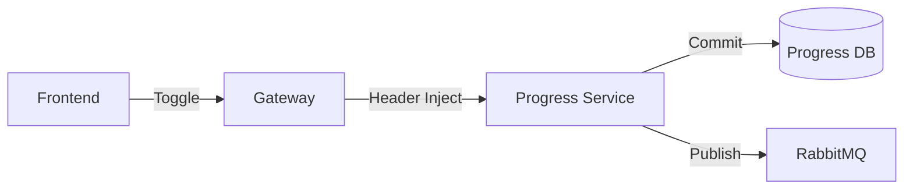

# 📈 Progress Service Complete Guide

The **Progress Service** is a dedicated microservice responsible for tracking and persisting user learning journeys across different roadmaps.

---

## 🏗️ 1. Architecture & Flow

This service operates on a **Single Responsibility Principle**: it only cares about which user completed which node.

### 🔄 Data Flow
1. **User Toggles Topic**: Frontend sends a `POST /toggle` request to the API Gateway.
2. **Gateway Enrichment**: Gateway verifies the JWT and injects `X-User-ID` into the request header.
3. **Progress Tracking**: Progress Service receives the request, identifies the user via the header, and updates the `user_progress` table.
4. **Event Emission**: The service publishes a `progress_updated` event to **RabbitMQ** to notify other services (e.g., for analytics or notifications).



---

## 💻 2. Code Breakdown

### 🛠️ Key Files

#### `app/models/models.py` (The Tracking Schema)
```python
class UserProgress(Base):
    __tablename__ = "user_progress"
    id: Mapped[uuid.UUID] = mapped_column(UUID(as_uuid=True), primary_key=True)
    user_id: Mapped[uuid.UUID] = mapped_column(...) # Injected from Gateway
    node_id: Mapped[uuid.UUID] = mapped_column(...) # The specific topic/chapter
    is_completed: Mapped[bool] = mapped_column(default=True)
```
> **Note**: This table uses a `UniqueConstraint` on `(user_id, node_id)` to ensure we never have duplicate progress records for the same topic.

#### `app/routers/progress.py` (The Toggle Logic)
We use a high-performance **"Upsert"** (Update or Insert) strategy for toggling:
```python
stmt = insert(UserProgress).values(...)
.on_conflict_do_update(
    index_elements=["user_id", "node_id"],
    set_={"is_completed": body.completed}
)
```
This ensures a single database call handles both the first-time completion and the un-checking of a topic.

---

## ⚡ 3. Technology Terminology

| Term | Explanation |
| :--- | :--- |
| **Upsert** | A database operation that either inserts a new row or updates an existing one if a conflict occurs. |
| **X-User-ID** | A custom HTTP header used to pass authenticated user identity between microservices. |
| **RabbitMQ (aio-pika)** | A message broker that allows services to "broadcast" events without waiting for a response. |

---

**Built with resilience for RoadmapHub.** 🚀
